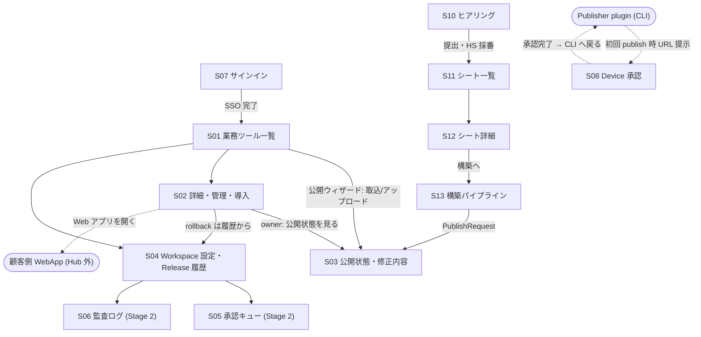

# 画面一覧と遷移 (段階 0 / 横串)

> Hub Web の全画面をここで確定する (足りない画面の発見はここが最後の砦)。個々の画面のワイヤーフレーム・コンポーネント設計は担当 feature の P02 で行う。
> **全画面共通の品質要件 (WCAG 2.2 AA / CWV good / 不快にさせない設計) は個別画面に書かない** — 共通コンポーネント側で一括担保する ([shared-layers.md](shared-layers.md) §1, qa-018)。

## 画面一覧

> **優先度列** = 構築優先順位 phase ([system-design-overview.md](system-design-overview.md) §3「構築優先順位」が正本。2026-07-18 ユーザー確定)。P0 基盤 (認証を最初に) → P1 ヒアリング (最優先) → P2 プラグイン Hub + パイプライン (最優先) → P3 改善ループ・ドキュメント → P4 ユーザー・効果測定 → P5 ダッシュボード・統制 (低)。

| ID | 画面 | 主な role | Stage | 優先度 | 担当 feature | 根拠 |
|---|---|---|---|---|---|---|
| S01 | プラグイン Hub 一覧 (Workspace Catalog。「プラグインを公開」→取込/アップロード・検索・導入) | member 以上 | 1 | **P2** | feat-dual-catalog-web + feat-publisher-plugin | qa-007 初期4画面, I1, I4 |
| S02 | 業務ツール詳細 (版/公開状態の管理・「追加/ダウンロード」「Web アプリを開く」・低品質報告・公開停止) | member 以上 | 1 | **P2** | feat-dual-catalog-web | qa-007, I3-I6 |
| S03 | 公開状態・修正内容 (PublishRequest 進捗 / Needs Fix 指摘) | owner 以上 | 1 | **P2** | feat-dual-catalog-web (表示) + feat-publish-pipeline (状態) | qa-007, I2 |
| S04 | Workspace 設定・Release 履歴 (IdP/Cloudflare 接続・role 管理・token 失効・rollback) | workspace-admin (履歴は owner も) | 1 | **P2** (IdP 接続登録のみ P0 先行) | feat-dual-catalog-web (+ governance が拡張) | qa-007, qa-005, qa-008 |
| S05 | 承認キュー (Yellow review) | workspace-admin | 2 | P5 (低) | feat-workspace-governance | I8 |
| S06 | 監査ログ・export | workspace-admin | 2 | P5 (低) | feat-workspace-governance | I8 |
| S07 | サインイン (テナント解決 → IdP redirect) | 全員 (未認証) | 1 | **P0 (最初)** | feat-auth-tenancy | qa-005 |
| S08 | Device 承認 (Publisher の verification code 確認) | owner | 1 | **P0 (最初)** | feat-auth-tenancy | qa-008 |

### Harness Studio mockup 由来の追加画面 (2026-07-17 反映。根拠: [mockups/harness-studio-v2-analysis.md](mockups/harness-studio-v2-analysis.md))

| ID | 画面 | 主な role | Stage | 優先度 | 担当 feature | mock id |
|---|---|---|---|---|---|---|
| S09 | ダッシュボード (KPI・推移・完了率・ランキング・部門別削減) | member 以上 | 拡張 | P5 (低) | feat-metrics-tracking | dashboard |
| S10 | ハーネス ヒアリング (4 ステップウィザード・削減試算) | member 以上 | 拡張 | **P1 (最優先)** | feat-hearing-intake | form |
| S11 | ヒアリングシート一覧 | member 以上 | 拡張 | **P1 (最優先)** | feat-hearing-intake | sheets |
| S12 | ヒアリングシート詳細 (status 変更は admin) | member 以上 | 拡張 | **P1 (最優先)** | feat-hearing-intake | sheet-detail |
| S13 | 構築パイプライン (7 工程ボード) | member 以上 (操作 admin) | 拡張 | **P2 (最優先)** | feat-build-pipeline-board | pipeline |
| S14 | 改善要望・レビュー (一覧 + Web フォーム) | member 以上 | 拡張 | P3 | feat-feedback-loop | feedback |
| S15 | ドキュメント (一覧/閲覧/編集・AI 下書き) | 閲覧 member / 編集 admin | 拡張 | P3 | feat-docs-cms | docs, doc-view, doc-edit |
| S16 | 利用・削減効果 (実行ログ集計・試算表) | member 以上 | 拡張 | P4 | feat-metrics-tracking | tracking |
| S17 | ユーザー管理 + 個別ダッシュボード (年収 PII 注意) | workspace-admin | 拡張 | P4 | feat-user-org-admin | users, user-detail |
| S18 | アカウント設定 (プロフィール/通知/表示。認証系は IdP 委譲) | member 以上 | 拡張 | P4 | feat-user-org-admin | account |

- mock の login はパスワード式のため**採用せず**、S07 (IdP redirect) を維持 (D3)。規約 (legal) は静的ページとして S18 配下に置く
- S02 (詳細) と S03 (公開状態) は mock の harness-detail / pipeline 内カードと統合する。mock 実測どおり、**公開ウィザード (upload-modal) は S01 の「プラグインを公開」モーダル**として feat-publisher-plugin + feat-publish-pipeline が担う。S02 は既存 Project の管理・導入面であり、新規取込の入口ではない

- 画面は S01-S18 で全ジャーニー ([user-journeys.md](user-journeys.md)) が閉じる。**新画面の追加はまず本表への追記から** (追加時は担当 feature と根拠 qa を必ず付ける)。
- 会話型 Web Creator 画面は作らない (U7 対象外・§5.1)。作者の操作面は Publisher plugin (CLI 対話) であり Web 画面を持たない。
- モバイル/タブレットは **S01-S18 のレスポンシブ表示**でカバーする (専用 native 画面なし。重点/簡易の区分は frontend-spec §6.4)。

## 最優先画面の完了境界 (mockup と実装仕様の照合結果)

| slice | 必須画面・操作 | 一覧/詳細に必ず表示する内容 | 完了条件 |
|---|---|---|---|
| **P1 ヒアリング** | S10 4 step 入力 → 受付番号表示 → S11 一覧 → S12 詳細 | S11: HS コード、status、title、domain/department、対象人数・月工数、申請者、更新日。S12: 生成本文 (概要/課題/機能タグ/試算)、元入力 snapshot、試算 snapshot、申請者/部門/作成日、生成状態、対応 Build | member は自分のシートを作成・一覧・詳細確認でき、admin はテナント内全件の確認と状態変更ができる。生成中は完了まで通知/ポーリングされる |
| **P2 プラグイン Hub** | S01 公開ウィザード (CLI 取込推奨、ZIP 代替) → 検査/公開 → S01 一覧 → S02 詳細管理 → install/download または Web app 起動 → S03 状態確認 | S01: name/summary/target/status/version/download count。S02: stable release、全 release、target 別の導入情報、公開状態、利用統計、低品質報告 | 同一 Workspace で複数 Project/target を扱え、owner が upload・管理し、member が認可済みの安定版を導入/ダウンロードできる。`public` visibility は Stage 5 まで表示しない |
| **P2 構築パイプライン** | S12「構築へ」→ S13 7 工程 → publish 工程で PublishRequest 接続 → S01/S02 | カード: title、HS/FR 参照、assignee、ETA、risk。公開工程は二重状態を持たず PublishRequest を表示 | ヒアリング結果から公開済みハーネスまで参照が切れず、認証・tenant scope が全操作に適用される |

- mock のシート status 表示「下書き」は backend の `received` に対応させ、UI の統一ラベルは「受付」とする。保存値は `received/generating/review/completed` の 4 値から増やさない。
- mock の「PDF でダウンロード」は S12 の認可済み表示データを印刷用レイアウトへ変換する。salary など権限外の値を export に混入させない。
- 「ダウンロード」は target 共通の利用者向け語彙とし、`skill` は Stage 0 で確定した marketplace/installer 導線、`web_app` は URL 起動を返す。生 ZIP の直接配布を既定導線にはしない。

## 画面遷移図

> 下図は公開系 (S01-S08) の遷移。**Studio 由来の画面 (S09-S18) は mockup 同様にグローバルナビゲーション (サイドバー / モバイルはボトムタブ) からの直遷移**であり、階層遷移を持つのは S11→S12 (一覧→詳細)・S12→S13 (シート→対応 build)・S15 の一覧→閲覧→編集のみ。ナビゲーション構成の正本は frontend-spec §3.0/§6.2。

## 共通レイアウト要素 (全画面共通・feat-hub-foundation が実装)

| 要素 | 内容 | 根拠 |
|---|---|---|
| グローバルヘッダ | Workspace 表示・ナビゲーション・ユーザーメニュー (role 表示) | qa-005 |
| 縮退バナー | Hub 障害時「導入済みツールはそのまま使えます」の明示 (SLO 前提の縮退設計) | qa-019 |
| 進捗表示 | 待ち時間のあるすべての操作 (publish 検査等) に進捗を出す | qa-018 |
| 確認ダイアログ | 破壊的操作 (公開停止・rollback・token 失効) は確認 + 可逆性の明示 | qa-018 |
| エラー表示 | 平易な日本語 + 次の一手。空状態にも導線を置く | qa-018 |
