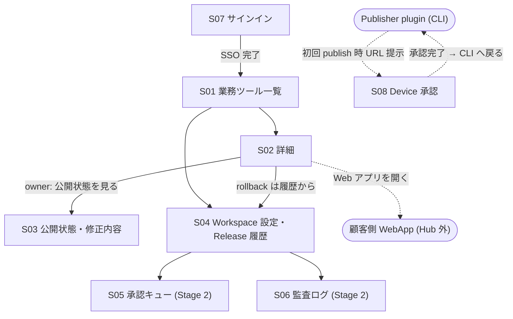

# 画面一覧と遷移 (段階 0 / 横串)

> Hub Web の全画面をここで確定する (足りない画面の発見はここが最後の砦)。個々の画面のワイヤーフレーム・コンポーネント設計は担当 feature の P02 で行う。
> **全画面共通の品質要件 (WCAG 2.2 AA / CWV good / 不快にさせない設計) は個別画面に書かない** — 共通コンポーネント側で一括担保する ([shared-layers.md](shared-layers.md) §1, qa-018)。

## 画面一覧

| ID | 画面 | 主な role | Stage | 担当 feature | 根拠 |
|---|---|---|---|---|---|
| S01 | 業務ツール一覧 (Workspace Catalog) | member 以上 | 1 | feat-dual-catalog-web | qa-007 初期4画面, I4 |
| S02 | 業務ツール詳細 (「追加する」「Web アプリを開く」低品質報告・公開停止) | member 以上 | 1 | feat-dual-catalog-web | qa-007, I4-I6 |
| S03 | 公開状態・修正内容 (PublishRequest 進捗 / Needs Fix 指摘) | owner 以上 | 1 | feat-dual-catalog-web (表示) + feat-publish-pipeline (状態) | qa-007, I2 |
| S04 | Workspace 設定・Release 履歴 (IdP/Cloudflare 接続・role 管理・token 失効・rollback) | workspace-admin (履歴は owner も) | 1 | feat-dual-catalog-web (+ governance が拡張) | qa-007, qa-005, qa-008 |
| S05 | 承認キュー (Yellow review) | workspace-admin | 2 | feat-workspace-governance | I8 |
| S06 | 監査ログ・export | workspace-admin | 2 | feat-workspace-governance | I8 |
| S07 | サインイン (テナント解決 → IdP redirect) | 全員 (未認証) | 1 | feat-auth-tenancy | qa-005 |
| S08 | Device 承認 (Publisher の verification code 確認) | owner | 1 | feat-auth-tenancy | qa-008 |

### Harness Studio mockup 由来の追加画面 (2026-07-17 反映。根拠: [mockups/harness-studio-v2-analysis.md](mockups/harness-studio-v2-analysis.md))

| ID | 画面 | 主な role | Stage | 担当 feature | mock id |
|---|---|---|---|---|---|
| S09 | ダッシュボード (KPI・推移・完了率・ランキング・部門別削減) | member 以上 | 拡張 | feat-metrics-tracking | dashboard |
| S10 | ハーネス ヒアリング (4 ステップウィザード・削減試算) | member 以上 | 拡張 | feat-hearing-intake | form |
| S11 | ヒアリングシート一覧 | member 以上 | 拡張 | feat-hearing-intake | sheets |
| S12 | ヒアリングシート詳細 (status 変更は admin) | member 以上 | 拡張 | feat-hearing-intake | sheet-detail |
| S13 | 構築パイプライン (7 工程ボード) | member 以上 (操作 admin) | 拡張 | feat-build-pipeline-board | pipeline |
| S14 | 改善要望・レビュー (一覧 + Web フォーム) | member 以上 | 拡張 | feat-feedback-loop | feedback |
| S15 | ドキュメント (一覧/閲覧/編集・AI 下書き) | 閲覧 member / 編集 admin | 拡張 | feat-docs-cms | docs, doc-view, doc-edit |
| S16 | 利用・削減効果 (実行ログ集計・試算表) | member 以上 | 拡張 | feat-metrics-tracking | tracking |
| S17 | ユーザー管理 + 個別ダッシュボード (年収 PII 注意) | workspace-admin | 拡張 | feat-user-org-admin | users, user-detail |
| S18 | アカウント設定 (プロフィール/通知/表示。認証系は IdP 委譲) | member 以上 | 拡張 | feat-user-org-admin | account |

- mock の login はパスワード式のため**採用せず**、S07 (IdP redirect) を維持 (D3)。規約 (legal) は静的ページとして S18 配下に置く
- S02 (詳細) と S03 (公開状態) は mock の harness-detail / pipeline 内カードと統合され、公開ウィザード (upload-modal) は S02 のモーダルとして feat-publisher-plugin + feat-publish-pipeline が担う

- 画面は S01-S18 で全ジャーニー ([user-journeys.md](user-journeys.md)) が閉じる。**新画面の追加はまず本表への追記から** (追加時は担当 feature と根拠 qa を必ず付ける)。
- 会話型 Web Creator 画面は作らない (U7 対象外・§5.1)。作者の操作面は Publisher plugin (CLI 対話) であり Web 画面を持たない。
- モバイル/タブレットは S01-S08 のレスポンシブ表示でカバー (専用画面なし。frontend 章の対象外理由)。

## 画面遷移図

## 共通レイアウト要素 (全画面共通・feat-hub-foundation が実装)

| 要素 | 内容 | 根拠 |
|---|---|---|
| グローバルヘッダ | Workspace 表示・ナビゲーション・ユーザーメニュー (role 表示) | qa-005 |
| 縮退バナー | Hub 障害時「導入済みツールはそのまま使えます」の明示 (SLO 前提の縮退設計) | qa-019 |
| 進捗表示 | 待ち時間のあるすべての操作 (publish 検査等) に進捗を出す | qa-018 |
| 確認ダイアログ | 破壊的操作 (公開停止・rollback・token 失効) は確認 + 可逆性の明示 | qa-018 |
| エラー表示 | 平易な日本語 + 次の一手。空状態にも導線を置く | qa-018 |
