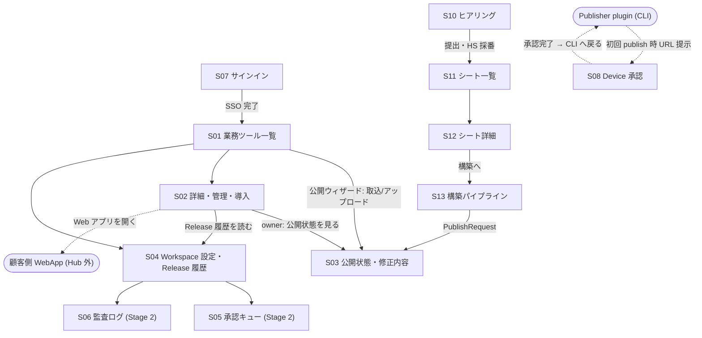

# 画面一覧と遷移 (段階 0 / 横串)

> Hub Web の全画面をここで確定する (足りない画面の発見はここが最後の砦)。個々の画面のワイヤーフレーム・コンポーネント設計は担当 feature の P02 で行う。
> **全画面共通の品質要件 (WCAG 2.2 AA / CWV good / 不快にさせない設計) は個別画面に書かない** — 共通コンポーネント側で一括担保する ([shared-layers.md](shared-layers.md) §1, qa-018)。

## 画面一覧

> **優先度列** = 構築優先順位 phase ([system-design-overview.md](system-design-overview.md) §3「構築優先順位」が正本。2026-07-18 ユーザー確定)。P0 基盤 (認証を最初に) → P1 ヒアリング (最優先) → P2 プラグイン Hub + パイプライン (最優先) → P3 改善ループ・ドキュメント → P4 ユーザー・効果測定 → P5 ダッシュボード・統制 (低)。

### Route surface profile SSOT

この表が、route ごとの role / task-mode / density / responsive pattern / sticky policy / 情報設計 sheet / test evidence の唯一の正本である。後続の S01–S18 表は journey と担当 feature の企画台帳であり、route 別 profile を上書きしない。

- `current` は `apps/hub/src/app/**/page.tsx` に実在する route と現行 API capability を表す。実装に無い route、modal、role 制限、変更操作を `current` と書かない。
- `planned` は製品判断または後続実装が必要な surface で、Decision ref が必須。`planned` を current route の完了証跡に数えない。
- role の `member+` / `workspace-admin+` は当該 role 以上を表す。閲覧と変更で capability が異なるときは 1 セル内で分ける。最終的な認可判定の正本は `apps/hub/src/lib/authz/rules.ts` である。
- density は surface の情報密度 (`comfortable / balanced / compact`)。wide / middle / narrow は順に `lg` 以上 / `md`–`lg` 未満 / `md` 未満。
- pattern は open-world だが、この表で使う語彙は `table / card-collection / form / wizard / content / detail / board / stage-selector+card-collection / chart+table / chart+card-collection / definition-list+form / settings-sections / timeline-stepper+form / grid+list` に固定する。`stage-selector+card-collection` は、工程を native control で 1 つ選び、選択工程のカードだけを縦に読む narrow 変形を表す。新語彙は定義と capability の根拠を追記してから使う。
- sticky policy の `public-header` は公開 shell のヘッダーのみ。`shell+screen` は Hub shell と `ScreenHeader`、`+filter` / `+table` / `+stepper` はその下に連続する sticky 要素を表す。座標と z-index は共通 UI contract が所有する。

<!-- ROUTE_SURFACES_BEGIN -->
| State | Surface ID | Route | Current role / capability | Task mode | Density | Wide | Middle | Narrow | Sticky policy | Information-design sheet | Test evidence | Decision ref |
|---|---|---|---|---|---|---|---|---|---|---|---|---|
| current | S07-L.ROOT | `/` | public / authenticated | choose | comfortable | form | form | form | public-header | `docs/features/feat-post-signin-scope-routing/information-design/S07-L.md` | `apps/hub/tests/routing/home-workspace-choice.test.ts` | — |
| current | S07.SIGNIN | `/[tenant_slug]/signin` | public | transit | comfortable | form | form | form | public-header | `docs/features/feat-auth-tenancy/information-design/S07.md` | `apps/hub/tests/auth-tenancy/signin-page.test.tsx` | — |
| current | S08.DEVICE | `/device` | signed-in member+ (`device.approve`) | input | comfortable | form | form | form | public-header | `docs/features/feat-auth-tenancy/information-design/S08.md` | `apps/hub/tests/auth-tenancy/device-approval-ui.test.ts` | — |
| current | S18.LEGAL | `/legal` | public | read | comfortable | content | content | content | public-header | `docs/features/feat-user-org-admin/information-design/legal.md` | `apps/hub/tests/user-org-admin/legal-page-contract.test.tsx` | — |
| current | S00.LANDING | `/dashboard` | member+ read (本人の recent。visible=false な機能は除外) | scan | balanced | grid+list | grid+list | grid+list | shell+screen | `docs/features/feat-hub-foundation/information-design/dashboard.md` | `apps/hub/src/__tests__/home-dashboard/home-dashboard-render.test.tsx` | — |
| current | S01.LIST | `/catalog` | member+ read | scan | balanced | table | table | card-collection | shell+screen+filter+table | `docs/features/feat-dual-catalog-web/information-design/S01.md` | `apps/hub/src/__tests__/dual-catalog-web/catalog-a11y.test.tsx` | — |
| current | S02.DETAIL | `/catalog/[projectId]` | member+ read / owner+ mutation | inspect | comfortable | detail | detail | detail | shell+screen | `docs/features/feat-dual-catalog-web/information-design/S02.md` | `apps/hub/src/__tests__/dual-catalog-web/catalog-a11y.test.tsx` | — |
| current | S01.PUBLISH | `/catalog/publish` | owner+ (`publish.request`) | input | comfortable | wizard | wizard | wizard | shell+screen+stepper | `docs/features/feat-publish-pipeline/information-design/S01-publish.md` | `apps/hub/src/__tests__/web-only-publish/wizard-and-entries.test.tsx` | — |
| current | S04.RELEASES | `/catalog/releases` | member+ read; rollback is not current | compare | compact | table | table | card-collection | shell+screen+table | `docs/features/feat-dual-catalog-web/information-design/S04-releases.md` | `apps/hub/tests/ui-foundation/list-ergonomics.test.tsx` | — |
| current | S13.BOARD | `/builds` | member+ read / workspace-admin+ stage change | monitor | balanced | board | board | stage-selector+card-collection | shell+screen | `docs/features/feat-build-pipeline-board/information-design/S13.md` | `apps/hub/src/__tests__/build-pipeline-board/board-screen.test.tsx` | — |
| current | S15.LIST | `/docs` | member+ read / workspace-admin+ create | scan | balanced | table | table | card-collection | shell+screen+filter+table | `docs/features/feat-docs-cms/information-design/S15.md` | `apps/hub/tests/docs-cms/a11y-screens.test.tsx` | — |
| current | S15.NEW | `/docs/new` | workspace-admin+ tenant / provider-admin common | input | comfortable | form | form | form | shell+screen | `docs/features/feat-docs-cms/information-design/docs-new.md` | `apps/hub/src/__tests__/docs-cms/document-screens-interaction.test.tsx` | — |
| current | S15.DETAIL | `/docs/[id]` | member+ read / workspace-admin+ edit | read | comfortable | content | content | content | shell+screen | `docs/features/feat-docs-cms/information-design/S15-detail.md` | `apps/hub/src/__tests__/docs-cms/document-screens-interaction.test.tsx` | — |
| current | S15.EDIT | `/docs/[id]/edit` | workspace-admin+ tenant / provider-admin common | input | comfortable | form | form | form | shell+screen | `docs/features/feat-docs-cms/information-design/S15-edit.md` | `apps/hub/src/__tests__/docs-cms/document-screens-interaction.test.tsx` | — |
| current | S14.LIST | `/feedback` | member+ read | scan | balanced | table | table | card-collection | shell+screen+filter+table | `docs/features/feat-feedback-loop/information-design/S14.md` | `apps/hub/tests/feedback-loop/a11y-screens.test.tsx` | — |
| current | S14.NEW | `/feedback/new` | member+ create | input | comfortable | form | form | form | shell+screen | `docs/features/feat-feedback-loop/information-design/S14-new.md` | `apps/hub/src/__tests__/feedback-loop/screen-interactions.test.tsx` | — |
| current | S14.DETAIL | `/feedback/[id]` | member+ read / workspace-admin+ status change | read | comfortable | detail | detail | detail | shell+screen | `docs/features/feat-feedback-loop/information-design/S14-detail.md` | `apps/hub/src/__tests__/feedback-loop/screen-interactions.test.tsx` | — |
| current | S09.METRICS | `/metrics` | member+ aggregate read | analyze | balanced | chart+table | chart+table | chart+card-collection | shell+screen+filter | `docs/features/feat-metrics-tracking/information-design/S09.md` | `apps/hub/src/__tests__/metrics-tracking/screen-interactions.test.tsx` | — |
| current | S16.USAGE | `/metrics/usage` | member+ aggregate read | compare | compact | table | table | table | shell+screen+filter+table | `docs/features/feat-metrics-tracking/information-design/S16.md` | `apps/hub/src/__tests__/metrics-tracking/screen-interactions.test.tsx` | — |
| current | S11.LIST | `/sheets` | member own / workspace-admin+ all | scan | balanced | table | table | card-collection | shell+screen+filter+table | `docs/features/feat-hearing-intake/information-design/S11.md` | `apps/hub/tests/hearing-intake/a11y-screens.test.tsx` | — |
| current | S10.NEW | `/sheets/new` | member+ create | input | comfortable | wizard | wizard | wizard | shell+screen+stepper | `docs/features/feat-hearing-intake/information-design/S10.md` | `apps/hub/tests/hearing-intake/a11y-screens.test.tsx` | — |
| current | S12.DETAIL | `/sheets/[id]` | member own / workspace-admin+ all and mutate | read | comfortable | detail | detail | detail | shell+screen | `docs/features/feat-hearing-intake/information-design/S12.md` | `apps/hub/tests/hearing-intake/a11y-screens.test.tsx` | — |
| current | S17.LIST | `/users` | workspace-admin+ | scan | balanced | table | table | card-collection | shell+screen+table | `docs/features/feat-user-org-admin/information-design/S17.md` | `apps/hub/tests/user-org-admin/screens-a11y-contract.test.tsx` | — |
| current | S17.DETAIL | `/users/[id]` | workspace-admin+ | manage | comfortable | definition-list+form | definition-list+form | definition-list+form | shell+screen | `docs/features/feat-user-org-admin/information-design/S17-detail.md` | `apps/hub/tests/user-org-admin/screens-a11y-contract.test.tsx` | — |
| current | S18.ACCOUNT | `/settings/account` | member+ self | manage | comfortable | settings-sections | settings-sections | settings-sections | shell+screen | `docs/features/feat-user-org-admin/information-design/S18.md` | `apps/hub/tests/user-org-admin/screens-a11y-contract.test.tsx` | — |
| current | S18.NOTION | `/settings/notion` | member+ read / workspace-admin+ mutation | manage | comfortable | definition-list+form | definition-list+form | definition-list+form | shell+screen | `docs/features/feat-user-org-admin/information-design/S18-notion.md` | `apps/hub/src/__tests__/notion-integration/notion-settings.test.tsx` | HarnessHub-hrux |
| current | S04.AUTH | `/settings/auth` | provider-admin | manage | comfortable | timeline-stepper+form | timeline-stepper+form | timeline-stepper+form | shell+screen | `docs/features/feat-dual-catalog-web/information-design/S04.md` | `apps/hub/tests/auth-tenancy/oidc-admin-a11y.test.tsx` | — |
| current | S10.COEFFICIENTS | `/settings/coefficients` | workspace-admin+ | manage | comfortable | definition-list+form | definition-list+form | definition-list+form | shell+screen | `docs/features/feat-hearing-intake/information-design/settings-coefficients.md` | `apps/hub/tests/routing/coefficients-settings.test.tsx` | — |
<!-- ROUTE_SURFACES_END -->

#### Current / planned 境界と承認事項

| 論点 | Current | Planned / historical | Decision ref |
|---|---|---|---|
| サインイン後の既定着地 | `DEFAULT_POST_SIGNIN_LANDING = /dashboard`。S00.LANDING が本人の最近と業務導線を表示する | S09 の分析 KPI は `/metrics` のまま別 surface | HarnessHub-1cno |
| 公開ウィザード | S01.PUBLISH は `/catalog/publish` の独立 page | S01 上の modal に戻す記述は historical。自動的に modal 化しない | HarnessHub-nqo5 |
| Device 承認 role | API `device.approve` は signed-in `member+` | owner 限定は未承認の role 変更。引き締めは別の製品判断 | HarnessHub-nqo5 |
| Release 履歴 | S04.RELEASES は project 指定後の read-only table / card | rollback 操作と master-detail は現行 surface に無い。実装済みと扱わない | HarnessHub-nqo5 |
| Docs の master-detail | S15.LIST は wide/middle table、narrow card-collection。詳細は別 route | 連続閲覧の実測後に採否を決める | HarnessHub-ydf8 |

| ID | 画面 | 主な role | Stage | 優先度 | 担当 feature | 根拠 |
|---|---|---|---|---|---|---|
| S01 | プラグイン Hub 一覧 (Workspace Catalog。「プラグインを公開」→取込/アップロード・検索・導入) | member 以上 | 1 | **P2** | feat-dual-catalog-web + feat-publisher-plugin | qa-007 初期4画面, I1, I4 |
| S02 | 業務ツール詳細 (版/公開状態の管理・「追加/ダウンロード」「Web アプリを開く」・低品質報告・公開停止) | member 以上 | 1 | **P2** | feat-dual-catalog-web | qa-007, I3-I6 |
| S03 | 公開状態・修正内容 (PublishRequest 進捗 / Needs Fix 指摘) | owner 以上 | 1 | **P2** | feat-dual-catalog-web (表示) + feat-publish-pipeline (状態) | qa-007, I2 |
| S04 | Workspace 設定・Release 履歴 (current: provider-admin の IdP 接続 + member 以上の read-only Release 履歴。rollback は planned) | capability ごとに route surface 表に分離 | 1 | **P2** (IdP 接続登録のみ P0 先行) | feat-dual-catalog-web (+ governance が拡張) | qa-007, qa-005, qa-008 |
| S05 | 承認キュー (Yellow review) | workspace-admin | 2 | P5 (低) | feat-workspace-governance | I8 |
| S06 | 監査ログ・export | workspace-admin | 2 | P5 (低) | feat-workspace-governance | I8 |
| S07 | サインイン (テナント解決 → IdP redirect) | 全員 (未認証) | 1 | **P0 (最初)** | feat-auth-tenancy | qa-005 |
| S07-L | **ランディング入口** (`/` テナント ID 入力・前回テナント導線・稼働確認。認証済みは着地 redirect または Workspace 選択) | 全員 | 1 | **P0 (最初)** | feat-post-signin-scope-routing (+ 入口選択は feat-workspace-switch-ux 一部) | qa-005, qa-135, issue-hub-root-500-signin-20260808 |
| S08 | Device 承認 (Publisher の verification code 確認) | current: signed-in member 以上 / owner 限定は planned | 1 | **P0 (最初)** | feat-auth-tenancy | qa-008 |

### Harness Studio mockup 由来の追加画面 (2026-07-17 反映。根拠: [mockups/harness-studio-v2-analysis.md](mockups/harness-studio-v2-analysis.md))

| ID | 画面 | 主な role | Stage | 優先度 | 担当 feature | mock id |
|---|---|---|---|---|---|---|
| S09 | ダッシュボード (KPI・推移・完了率・ランキング・部門別削減) | member 以上 | 拡張 | P5 (低) | feat-metrics-tracking | dashboard |
| S10 | ハーネス ヒアリング (4 大工程を7画面に分割したウィザード・削減試算・作成時添付) | member 以上 | 拡張 | **P1 (最優先)** | feat-hearing-intake | form |
| S11 | ヒアリングシート一覧 | member 以上 | 拡張 | **P1 (最優先)** | feat-hearing-intake | sheets |
| S12 | ヒアリングシート詳細 (status 変更は admin) | member 以上 | 拡張 | **P1 (最優先)** | feat-hearing-intake | sheet-detail |
| S13 | 構築パイプライン (7 工程ボード) | member 以上 (操作 admin) | 拡張 | **P2 (最優先)** | feat-build-pipeline-board | pipeline |
| S14 | 改善要望・レビュー (一覧 + Web フォーム) | member 以上 | 拡張 | P3 | feat-feedback-loop | feedback |
| S15 | ドキュメント (一覧/閲覧/編集・AI 下書き) | 閲覧 member / 編集 admin | 拡張 | P3 | feat-docs-cms | docs, doc-view, doc-edit |
| S16 | 利用・削減効果 (実行ログ集計・試算表) | member 以上 | 拡張 | P4 | feat-metrics-tracking | tracking |
| S17 | ユーザー管理 + 個別ダッシュボード (年収 PII 注意) | workspace-admin | 拡張 | P4 | feat-user-org-admin | users, user-detail |
| S18 | アカウント設定 (プロフィール/通知/表示。認証系は IdP 委譲) | member 以上 | 拡張 | P4 | feat-user-org-admin | account |

- mock の login はパスワード式のため**採用せず**、S07 (IdP redirect) を維持 (D3)。規約 (legal) は current surface `S18.LEGAL` (`/legal`) として登録する
- S02 (詳細) と S03 (公開状態) は harness-detail 内で統合する。**current の公開ウィザードは S01.PUBLISH (`/catalog/publish`) の独立 page** である。upload-modal 案は historical / planned であり、承認なしに current へ戻さない。S02 は既存 Project の管理・導入面であり、新規取込の入口ではない

- journey family は S01-S18 で管理し、実 route は surface variant 表で閉じる。**新 route の追加は実装より先に surface 行と担当 sheet / evidence を追記する**。
- 会話型 Web Creator 画面は作らない (U7 対象外・§5.1)。作者の操作面は Publisher plugin (CLI 対話) であり Web 画面を持たない。
- モバイル/タブレットは **S01-S18 のレスポンシブ表示**でカバーする（専用 native 画面なし。route ごとの wide / middle / narrow profile は本書の current surface 表を正本とする）。

## 最優先画面の完了境界 (mockup と実装仕様の照合結果)

| slice | 必須画面・操作 | 一覧/詳細に必ず表示する内容 | 完了条件 |
|---|---|---|---|
| **P1 ヒアリング** | S10 4 大工程 / 7画面入力 → 受付番号表示 → S11 一覧 → S12 詳細 | S11: HS コード、status、title、domain/department、対象人数・月工数、申請者、更新日。S12: 生成本文 (概要/課題/機能タグ/試算)、元入力 snapshot 全項目、試算 snapshot、申請者/部門/作成日、生成状態、対応 Build | member は自分のシートを作成・一覧・詳細確認でき、admin はテナント内全件の確認と状態変更ができる。生成中は完了まで通知/ポーリングされる |
| **P2 プラグイン Hub** | S01.PUBLISH page (CLI 取込推奨、ZIP 代替) → 検査/公開 → S01.LIST → S02.DETAIL → install/download または Web app 起動 → S03 状態確認 | S01: name/summary/target/status/version/download count。S02: stable release、全 release、target 別の導入情報、公開状態、利用統計、低品質報告 | 同一 Workspace で複数 Project/target を扱え、owner が upload・管理し、member が認可済みの安定版を導入/ダウンロードできる。`public` visibility は Stage 5 まで表示しない |
| **P2 構築パイプライン** | S12「構築へ」→ S13 7 工程 → publish 工程で PublishRequest 接続 → S01/S02 | **current MVP**: カードは title、起点種別、滞留から算出した risk。担当者・ETA は current の永続化/API 契約に無いため、根拠のない空欄を作らない。**target design**: source 参照・assignee・ETA・project metadata は Build ADR §2 の後続差分として current UI から分離する。公開工程は二重状態を持たず PublishRequest を正本にする | current は member 閲覧、workspace-admin 以上の隣接工程操作、認証・tenant scope、PublishRequest 前提、監査を満たす。target design の metadata 完了を current surface の完了表示に混ぜない |

- mock のシート status 表示「下書き」は backend の `received` に対応させ、UI の統一ラベルは「受付」とする。保存値は `received/generating/review/completed` の 4 値から増やさない。
- mock の「PDF でダウンロード」は、製品所有の印刷ボタンを出さず、print stylesheet だけを残す（2026-08-15 / `HarnessHub-s36m`）。salary など権限外の値を印刷 DOM に混入させない。全ページ印刷は `HarnessHub-wx4h`。
- 「ダウンロード」は target 共通の利用者向け語彙とし、`skill` は Stage 0 で確定した marketplace/installer 導線、`web_app` は URL 起動を返す。生 ZIP の直接配布を既定導線にはしない。

## 画面遷移図

> 下図は公開系 (S01-S08) の遷移。**Studio 由来の画面 (S09-S18) は mockup 同様にグローバルナビゲーション (サイドバー / モバイルはボトムタブ) からの直遷移**であり、階層遷移を持つのは S11→S12 (一覧→詳細)・S12→S13 (シート→対応 build)・S15 の一覧→閲覧→編集のみ。ナビゲーション構成の正本は frontend-spec §3.0/§6.2。

```mermaid
graph TD
    S07["S07 サインイン"] -->|SSO 完了| S01["S01 業務ツール一覧"]
    S01 -->|"公開ウィザード: 取込/アップロード"| S03["S03 公開状態・修正内容"]
    S01 --> S02["S02 詳細・管理・導入"]
    S02 -->|"owner: 公開状態を見る"| S03["S03 公開状態・修正内容"]
    S01 --> S04["S04 Workspace 設定・Release 履歴"]
    S02 -->|"Release 履歴を読む"| S04
    S04 --> S05["S05 承認キュー (Stage 2)"]
    S04 --> S06["S06 監査ログ (Stage 2)"]
    EXT1(["Publisher plugin (CLI)"]) -.->|"初回 publish 時 URL 提示"| S08["S08 Device 承認"]
    S08 -.->|承認完了 → CLI へ戻る| EXT1
    S02 -.->|"Web アプリを開く"| EXT2(["顧客側 WebApp (Hub 外)"])
    S10["S10 ヒアリング"] -->|"提出・HS 採番"| S11["S11 シート一覧"]
    S11 --> S12["S12 シート詳細"]
    S12 -->|"構築へ"| S13["S13 構築パイプライン"]
    S13 -->|"PublishRequest"| S03
```

## 共通レイアウト要素 (全画面共通・feat-hub-foundation が実装)

| 要素 | 内容 | 根拠 |
|---|---|---|
| グローバルヘッダ | Workspace 表示・ナビゲーション・ユーザーメニュー (role 表示) | qa-005 |
| 縮退バナー | Hub 障害時「導入済みツールはそのまま使えます」の明示 (SLO 前提の縮退設計) | qa-019 |
| 進捗表示 | 待ち時間のあるすべての操作 (publish 検査等) に進捗を出す | qa-018 |
| 確認ダイアログ | 破壊的操作 (公開停止・rollback・token 失効) は確認 + 可逆性の明示 | qa-018 |
| エラー表示 | 平易な日本語 + 次の一手。空状態にも導線を置く | qa-018 |
| 情報設計 | 10 工程・情報顕著度・要素別意味契約・open-world pattern 選定を全画面共通の規範で行う | [UI 基盤の使い方と検証](frontend-ui-foundation-spec.md#0-部品を選ぶ前に情報設計を済ませる) |

## 適応型画面プロファイル正本

この節だけが画面プロファイル割当の SSOT (単一の正本) である。他文書は profile の schema や選び方を説明してよいが、画面 ID ごとの値を複製しない。従来の画面単位 `理解優先 / 密度優先` 二値は廃止し、同じ画面でも `role × task-mode × breakpoint` に応じて変える。

- `intent`: `scan` (対象/状態を見つける) / `compare` (複数対象を突合する) / `compose` (入力・変更を完了する) / `monitor` (時間変化・進捗を見る)
- `density`: `comfortable` / `balanced` / `compact`。機能を削ってよい度合いではない。
- `pattern`: [UI 基盤の使い方と検証](frontend-ui-foundation-spec.md#0-部品を選ぶ前に情報設計を済ませる) の open-world registry にある id または hybrid。`table / card-collection / list / grid / form / wizard / timeline-stepper / board / chart+table / tree / master-detail` は初期値であり閉じた集合ではない。
- breakpoint は `narrow <= 640px`、`middle = 641〜1024px`、`wide >= 1025px` の profile 名を用いる (Harness Studio デザインシステム §4 の 3 区分)。UI 基盤 `breakpointTokens` の `480px` は narrow 内の layout step として使い、profile を4区分には増やさない。境界値の正本は UI 基盤 `breakpointTokens` (`480 / 641 / 1025`) とする。

| ID / surface | role | task-mode | wide / middle profile (`intent · density · pattern`) | narrow profile (`intent · density · pattern`) | breakpoint をまたいで保持する能力 |
|---|---|---|---|---|---|
| S01 一覧 | member 以上 | browse/install | `scan · balanced · table` | `scan · comfortable · card-collection` | 検索、filter、状態、stable version、download count、詳細/導入導線 |
| S01 公開 | owner 以上 | publish | `compose · balanced · wizard+form` | `compose · comfortable · wizard+form` | checkpoint 再開、error summary、戻る/取消、PublishRequest 追跡 |
| S02 | member 以上 | inspect/install | `scan · comfortable · master-detail` | `scan · comfortable · master-detail (stacked)` | stable/全 release、target 別導入、完全な識別子、copy/open |
| S02 | owner 以上 | manage | `compare · balanced · master-detail+table` | `compose · balanced · master-detail+list` | promote/rollback/suspend、状態、対象 release、確認/回復 |
| S03 | owner 以上 | monitor/fix | `monitor · balanced · timeline-stepper+list` | `monitor · comfortable · timeline-stepper+list` | 現在状態、完了/失敗、Needs Fix、再投入/取消、絶対日時 |
| S04 設定 | workspace-admin | configure | `compose · balanced · form` | `compose · comfortable · form` | 可視 label、validation、保存結果、token/IdP の安全な回復 |
| S04 Release 履歴 | owner / workspace-admin | compare/rollback | `compare · compact · table+master-detail` | `compare · balanced · list+master-detail` | filter、順序、release 完全値、対象比較、rollback |
| S05 | workspace-admin | review/bulk-review | `compare · compact · table+master-detail` | `compare · balanced · card-collection+master-detail` | filter、選択 mode、一括/個別承認、理由、件数、error recovery |
| S06 | workspace-admin | audit/export | `compare · compact · table` | `scan · balanced · list+filter-form` | filter、時系列、actor/action/target、完全日時、export |
| S07 | public | sign-in | `compose · comfortable · form` | `compose · comfortable · form` | tenant/IdP の可視 label、error summary、再試行、privacy 導線 |
| S07-L | public / member | choose-entry/scope | `scan · comfortable · form+list` | `scan · comfortable · form+list` | Workspace 候補、前回値、稼働異常、sign-in/redirect の次の一手 |
| S08 | owner | approve-device | `compose · comfortable · form` | `compose · comfortable · form` | user code、対象/権限、承認/拒否、期限、結果 focus |
| S09 | member 以上 | monitor-metrics | `monitor · balanced · chart+table` | `monitor · comfortable · chart+table (stacked)` | KPI 定義、期間、正確な値の表、系列 label、全件導線 |
| S09-L | member 以上 | resume-work | `scan · comfortable · card-collection+list` | `scan · comfortable · list` | 現在 Workspace、最近の作業、既存画面への導線、異常時 status |
| S10 | member 以上 | create-hearing | `compose · balanced · wizard+form` | `compose · comfortable · wizard+form` | step/全体進捗、可視 label、戻る/再開、試算根拠、error summary |
| S11 | member / workspace-admin | browse-sheets | `scan · balanced · table` | `scan · comfortable · card-collection` | status/HS code/title/domain/department/people/hours/applicant/完全日時、filter、検索、paging、詳細 |
| S12 | member 以上 | inspect-sheet | `scan · comfortable · master-detail` | `scan · comfortable · master-detail (stacked)` | status、生成本文、snapshot、試算、Build 参照、完全日時 |
| S12 | workspace-admin | change-status/regenerate | `compose · balanced · master-detail+form` | `compose · comfortable · master-detail+form` | 認可済み操作、理由、確認、結果、member 表示との分離 |
| S13 | member 以上 | monitor-build | `monitor · balanced · board` | `monitor · comfortable · timeline-stepper+card-collection` | 全工程と件数、現在工程、HS/FR、assignee/ETA/risk、詳細 |
| S13 | workspace-admin | move-stage | `compare · compact · board` | `compare · balanced · timeline-stepper+card-collection` | 隣接遷移、対象選択、確認、DnD 以外の操作、全工程の位置 |
| S14 一覧 | member 以上 | browse-feedback | `scan · balanced · table` | `scan · comfortable · card-collection` | type/status/対象/更新日時、filter、検索、詳細 |
| S14 起票 | member 以上 | create-feedback | `compose · comfortable · form` | `compose · comfortable · form` | 可視 label、validation、下書き/送信、AI 回答への到達 |
| S15 一覧/閲覧 | member 以上 | browse/read | `scan · comfortable · list+master-detail` | `scan · comfortable · list+master-detail (stacked)` | 階層/タイトル/更新日時、検索、本文、現在位置 |
| S15 編集 | workspace-admin | edit | `compose · balanced · form+master-detail` | `compose · comfortable · form` | Markdown 入力、preview、保存状態、AI 下書き、error recovery |
| S16 | member 以上 | monitor-impact | `monitor · balanced · chart+table` | `monitor · comfortable · chart+table (stacked)` | 期間/dimension、サーバ集計値、正確な値の表、系列 label、権限境界 |
| S17 一覧 | workspace-admin | compare-users/bulk-manage | `compare · compact · table+master-detail` | `compare · balanced · card-collection+master-detail` | filter、sort、選択 mode、一括/個別操作、salary mask、完全値、個別詳細 |
| S17 個別 | workspace-admin | inspect/edit-user | `compose · balanced · master-detail+form` | `compose · comfortable · master-detail+form` | role、組織、利用状況、salary toggle、監査可能な変更結果 |
| S18 | member 以上 | configure-account | `compose · comfortable · form` | `compose · comfortable · form` | visible label、theme/density/language、通知、保存結果、legal |
| 通知 | member 以上 | monitor-notifications | `monitor · balanced · list` | `monitor · comfortable · list` | 未読/既読、順序、完全日時、遷移、既読操作、スワイプ不要 |

- `table → card-collection/list` は見た目の変換であり、比較・filter・sort・選択・一括操作・完全値を削る許可ではない。狭幅では selection mode、filter sheet、detail disclosure、局所横スクロール等で同じ能力を維持する。
- 新画面または task-mode を追加するときは、担当 feature と根拠 qa を画面一覧へ、全 role / breakpoint profile を本表へ同一変更で追記する。未記入を暗黙の既定へ落とさない。
- 情報設計シート (`docs/features/<feature>/information-design/<screen-id>.md`) は本表を参照し、profile 値を複製しない。手順とチェックリストは [UI 基盤の使い方と検証](frontend-ui-foundation-spec.md#route-surface-を閉じる手順) に従う。
