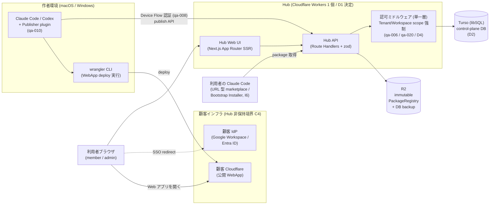

# Harness Hub システム全体設計 (段階 0 / 横串) — 目次と構成図

> 本書は**参照型**: 要件・数値・技術決定の正本は `system-spec/` (憲法)。ここには「全体の形」だけを書き、正本の内容を複製しない。
> 4 部構成: 本書 (構成図・データフロー・全体タスクマップ) / [user-journeys.md](user-journeys.md) / [screen-inventory.md](screen-inventory.md) / [shared-layers.md](shared-layers.md)

## 1. システム構成図 (コンテナレベル)

- Hub は**単一 Worker** (UI + API 同居、D1 決定)。分割しない理由 = C1 (個人運用) と D1 の確定内容。
- Hub が**保持しないもの** (C4 非保持境界): 顧客の業務データ・secret・WebApp runtime。WebApp は顧客側 Cloudflare で動き、Hub は URL 登録・公開範囲検査・health 確認のみ (I5)。

## 2. 主要データフロー (どのデータがどこで生まれ、どこに置かれるか)

| フロー | 経路 | 正本の置き場 | 根拠 |
|---|---|---|---|
| 公開 (publish) | Publisher → API → 検査 pipeline → Green なら Release 確定 | package 実体 = R2 (immutable)、メタ = Turso | I2, I3 |
| 公開ポインタ | Promote / Rollback = TargetChannel の stable pointer 差替のみ | Turso (pointer)、R2 は不変 | I3 |
| catalog 閲覧 | ブラウザ → UI (SSR) → API → Turso | Turso (CatalogEntry) | I4 |
| package 導入 | 利用者 Claude Code → marketplace URL → API → R2 | R2 | I6 |
| 監査 | 全変更操作 → 監査 event 書込 (append-only) → Stage 2 で画面/export | Turso (監査 event) | I8 |
| バックアップ | Turso 日次 export → R2 保存 → 四半期 restore drill | R2 | qa-019 |

## 3. 全体タスクマップ (何をやらないといけないかの地図)

横 = 8 feature (縦串)、縦 = 成果物の種類。各セルの詳細設計は該当 feature の P02 task で行う (ここでは所在だけを固定する)。

| feature | 画面 (screen-inventory 参照) | API / ドメイン | 共通層への依存 (shared-layers 参照) |
|---|---|---|---|
| feat-stage0-distribution-gate | なし (検証レポートのみ) | なし (H3/H6/H7 検証) | なし (最初に単独実行可) |
| feat-hub-foundation | 共通レイアウト・エラー/縮退表示 | /health, プロジェクト骨格 | **共通層すべての実装 owner** |
| feat-domain-model-db | なし | Tenant/Workspace/Project/Release/TargetChannel/CatalogEntry/PublishRequest/監査event のスキーマと repository | repository 層, zod schemas |
| feat-auth-tenancy | S07 サインイン, S08 Device 承認 | Auth.js OIDC 動的解決, Device Flow, role 4種 (qa-005) | 認可 MW, auth adapter |
| feat-publish-pipeline | なし (状態は S03 が表示) | PublishRequest 状態機械, 検査 (Green/Yellow/Red), Release 採番, promote/rollback | 検査共有 package, 監査 logger |
| feat-publisher-plugin | なし (CLI/plugin 対話面) | Hub API クライアント, wrangler スクリプト実行, URL 登録 | 検査共有 package (ローカル pre-check) |
| feat-dual-catalog-web | S01 一覧, S02 詳細, S03 公開状態, S04 Workspace 設定 | catalog 読取 API, 低品質報告, 更新通知 | design system, 認可 MW |
| feat-workspace-governance | S05 承認キュー, S06 監査ログ | approval queue, granular RBAC, audit export, Yellow review | 認可 MW, 監査 logger |

### Studio mockup 反映による feature 追加 (2026-07-17。要件層への反映は analysis §6-7 の手順で実施)

| feature 候補 | 画面 (screen-inventory) | API / ドメイン | 共通層への依存 |
|---|---|---|---|
| feat-metrics-tracking | S09 ダッシュボード, S16 利用・削減効果 | 実行ログ ingest (B2)・rollup (B3)・MetricsEvent | 試算エンジン, チャート部品 |
| feat-hearing-intake | S10 ヒアリング, S11/S12 シート | HearingSheet/FormData API・受付番号採番 | AI 処理キュー (D5), ウィザード部品 |
| feat-build-pipeline-board | S13 構築パイプライン | Build (7 stage)・工程操作 (admin) | ステージボード部品, 監査 logger |
| feat-feedback-loop | S14 改善要望・レビュー | Feedback (CLI+Web 2 経路)・status 遷移 | AI 処理キュー (D5), Markdown 部品 |
| feat-docs-cms | S15 ドキュメント | Doc (common/tenant scope)・AI 下書き | Markdown 部品 (XSS sanitize), AI キュー |
| feat-user-org-admin | S17 ユーザー管理, S18 アカウント設定 | User CRUD・role・係数設定・通知設定 | PII ガード, 試算エンジン, 通知ディスパッチ |

依存の向き: いずれも feat-hub-foundation / feat-domain-model-db / feat-auth-tenancy の下流。feat-metrics-tracking は feat-user-org-admin (年収データ) に、feat-feedback-loop は feat-publish-pipeline に依存する。

## 4. 本書で「書かない」もの (境界の宣言)

- **対象外 platform**: native モバイル / タブレット / Linux desktop (収集マトリクスで理由付き対象外確定済み)
- **Stage 3-5 の構想** (独自 runtime, deployment engine, 公開 marketplace, 収益分配, Result Dashboard): U7 対象外。設計しない
- **ER 図のカラム定義・API スキーマ・画面ワイヤーフレーム**: 縦串 P02 (各 feature の architecture task) の成果物。横串には書かない
- **技術選定の理由・比較**: D1-D4 (要件定義書の意思決定表) に確定済み。再説明しない
- **品質数値 (WCAG 2.2 AA / CWV good / SLO 99.5%)**: qa-018 / qa-019 が正本。参照のみ
